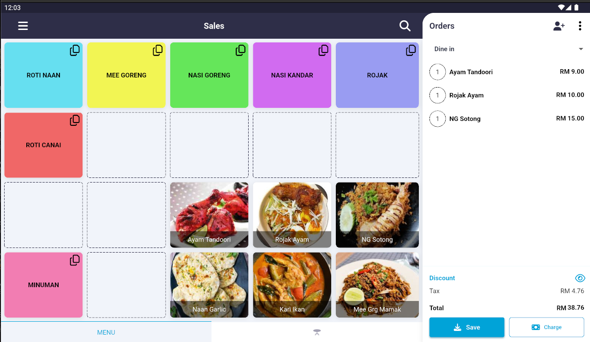
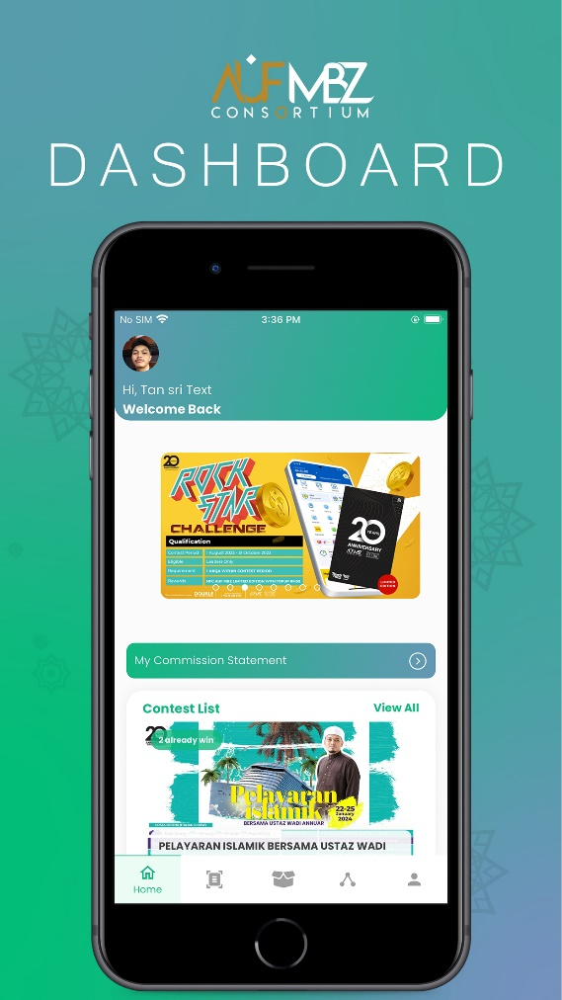
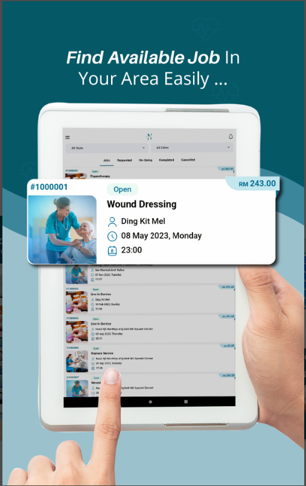
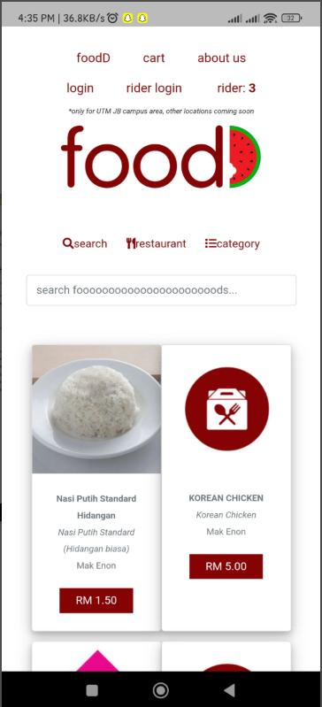
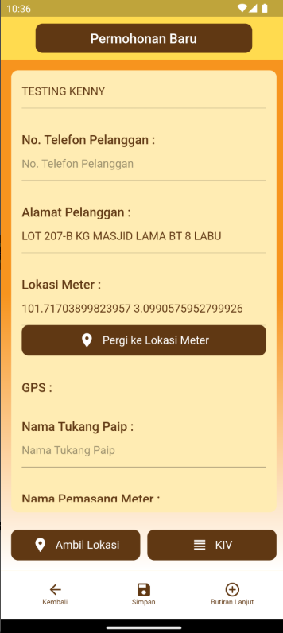
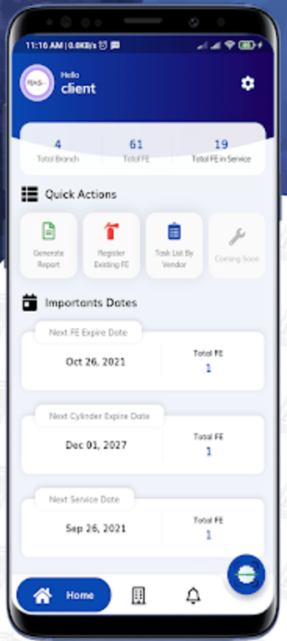

# MUHAMMAD IZZAT BIN MOHAMAD RIZAL

013-2961685 | mizzat0909@gmail.com
Subang Impian, Selangor, Malaysia

Delivering high-quality work on time is my top priority, as strive to establish myself as a valuable asset in the development of innovative mobile applications.

## EDUCATION

Project: "Quran Memorizing Interactive Application for Autistic Children"
**Bachelor of Computer Science (Software Engineering) with Honors** — Mar 2021 – Jun 2023
Universiti Malaysia Pahang

Project: "Student Attendance System using Arduino"
**Diploma of Computer Science** — June 2018 – Feb 2021
Universiti Malaysia Pahang

## WORKING EXPERIENCE

**Full Stack Senior Developer** — December 2025 until present

Cloone Corporation Sdn Bhd
- Involved in both web and mobile application development
- Collaborate with the team on feature delivery and code review
- Deploy and maintain staging/production environments
- Maintain code quality and code architecture

**Head of Department Mobile Application Development** — January 2023 until Nov 2025

Mahiran Digital Sdn Bhd
- Overseeing the management of the mobile development department
- Ensuring efficient workflow in the office
- Conducting meeting with the project client

**Junior Laravel Developer** — August 2023 until Nov 2025

Mahiran Digital Sdn Bhd
- Define all the data dictionaries and designed the web application interface
- Design the interface and the functionality of the mobile application
- Debugging the web app

**Senior Flutter Developer** — January 2023 until Nov 2025

Mahiran Digital Sdn Bhd
- Managing and handling the mobile team's project to distribute to the employees
- Helping the junior developer for the mobile application development

**Junior Flutter Developer** — July 2021 until Dec 2022

Mahiran Digital Sdn Bhd
- Designed the mobile applications interface
- Developed the connection of the interface with the API Hosting

## SKILLS

### Technical Skills
Flutter Dart, SQL, JSON, Laravel, Git, Php, Figma, Photoshop

### Leadership Skills
- Project Leader Developer, AUF MBZ Consortium Mobile Application, December 2022 until 2024
- Project Manager, Private Nursing Home Mobile Application, March 2023 until 2024
- Project Manager, Mysztech POS System, January 2024 until present

## PROJECTS

### POS System Mobile Application for Myzstech Sdn Bhd

A pos system software for managing sales, payments and restaurants
- Design the UI/UX, implement local database and live update using pusher service
- Monthly meeting with the client for progress update

Stack: Flutter, Postman, PHP, Pusher
Status: The project is still in the development

### Website Based Registration System for IFCEM 2024

A web application for registration with admin panel for BOMBA event in 2024
- Design the interface, data dictionary and functionality of the web application
- Weekly meeting with BOMBA for progress update

Stack: Laravel, PHP, MySQL
Status: The system has been closed due to expired

### AUF Consortium Mobile Application System (AUFMBZ)

Admin system and mobile app system for user to record and track their sales, downlines and more.
- Design the interface and the functionality of the mobile application
- Monthly meeting with AUFMBZ staff for progress update
- Upload the app to the Play Store and Apps Store

Stack: Flutter, MySQL, Web API, Pusher, Firebase Cloud Messaging
Status: The project has been closed due to client problem

### Private Nurse to Home (Nurse2u)

Mobile app system for client to hire a nurse for their patient, to seek job for nurse and to record and track their job, patients, client, nurse and more.
- Design the interface and the functionality of the mobile application
- Upload the app to the Play Store and Apps Store

Stack: Flutter, MySQL, Web API, Pusher, Firebase Cloud Messaging
Link: https://play.google.com/store/apps/details?id=com.nurse2u.asia&hl=en&pli=1

### FoodD

Mobile app system for student and food seller and rider to buy food, sell food, and deliver food around university campus
- Load the webview in the app that made by the client
- Implement foreground and background notification from the webview
- Upload to the Play Store and Apps Store

Stack: Flutter, Pusher, Firebase Cloud Messaging
Link: https://play.google.com/store/apps/details?id=com.foodd.utmholdings&hl=en

### Class Attendance using NFC and QR Code (SCANFC)
Mobile app system for student and lecturer to create class, submit attendance and record attendance of the students using NFC and QR Code
- Design the interface and the functionality of the mobile application

Stack: Flutter, MySQL, Web API

### Authentication and self-recovery using a new pdf (MyPdf)
Mobile app system for user to encrypt their pdf using watermark key algorithm
- Design the interface and the functionality of the mobile application
- Upload the app to the Play Store and Apps Store

Stack: Flutter, MySQL, Web API

### Authentication and self-recovery using a new image (Ausr)
Mobile app system for user to encrypt their image using watermark key algorithm
- Design the interface and the functionality of the mobile application
- Upload the app to the Play Store and Apps Store

Stack: Flutter, MySQL, Web API

### METIS

Mobile app for contractor that work with Syarikat Air Negeri Sembilan (SAINS) to manage pipes around Negeri Sembilan
- Update the interface and the functionality of the mobile app
- Upload the app to the Play store and the Apps Store

Stack: Flutter, MySQL
Link: https://play.google.com/store/apps/details?id=com.metis.sains.metis_sains&hl=en

### Fire Audit

Mobile app system for fire contractor and building owner to service and keep record tracking of fire extinguisher and fire equipment system using NFC and OCR Image
- Design the interface and the functionality of the mobile application
- Offline database for fire contractor to do the inspection
- Upload the app to the Play Store and Apps Store

Stack: Flutter, MySQL, Web API
Link: https://play.google.com/store/apps/details?id=com.md.fireaudit&hl=en

## REFEREES

**Mr. Mohamad Mohsin Bin Ismail**
CEO, Chief Executive Officer
Mahiran Digital Sdn Bhd, 40150 Shah Alam, Selangor
Phone: 013-6729087
Email: mohsin@mahirandigital.com
